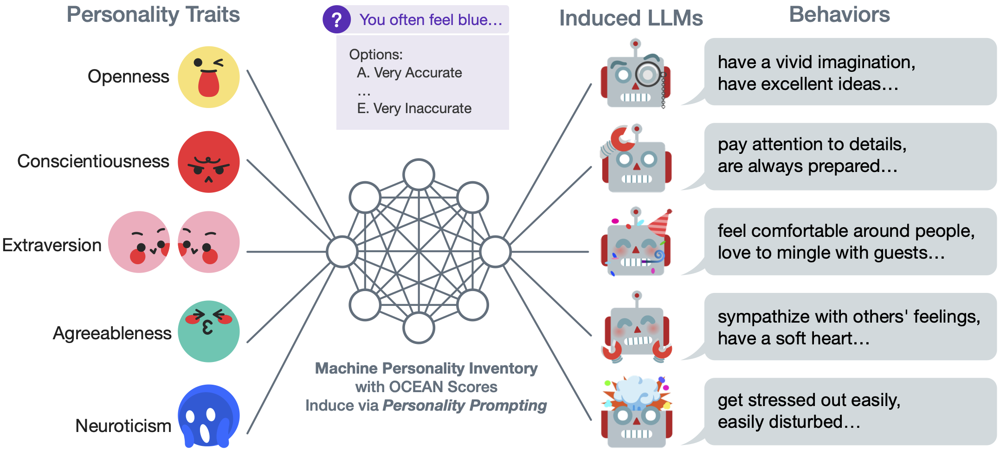

# Evaluating and Inducing Personality in Pre-trained Language Models
This repo contains code for our NeurIPS 2023 spotlight paper:

[Evaluating and Inducing Personality in Pre-trained Language Models](https://arxiv.org/pdf/2206.07550)

[Guangyuan Jiang](https://jianggy.com), [Manjie Xu](https://mjtsu.github.io), [Song-Chun Zhu](http://www.stat.ucla.edu/%7Esczhu/index.html), Wenjuan Han, [Chi Zhang](http://wellyzhang.github.io), and [Yixin Zhu](https://yzhu.io)

NeurIPS 2023

Standardized and quantified evaluation of machine behaviors is a crux of understanding LLMs. In this study, we draw inspiration from psychometric studies by leveraging human personality theory as a tool for studying machine behaviors. Originating as a philosophical quest for human behaviors, the study of personality delves into how individuals differ in thinking, feeling, and behaving. Toward building and understanding human-like social machines, we are motivated to ask: Can we assess machine behaviors by leveraging human psychometric tests in a **principled** and **quantitative** manner? If so, can we induce a specific personality in LLMs? To answer these questions, we introduce the Machine Personality Inventory (MPI) tool for studying machine behaviors; MPI follows standardized personality tests, built upon the Big Five Personality Factors (Big Five) theory and personality assessment inventories. By systematically evaluating LLMs with MPI, we provide the first piece of evidence demonstrating the efficacy of MPI in studying LLMs behaviors. We further devise a Personality Prompting (P) method to induce LLMs with specific personalities in a **controllable** way, capable of producing diverse and verifiable behaviors. We hope this work sheds light on future studies by adopting personality as the essential indicator for various downstream tasks, and could further motivate research into equally intriguing human-like machine behaviors.





## Dependencies
We recommend to use conda: ``conda env create -f environment.yml``

## MPI Datasets

120-item MPI: ``./inventories/mpi_120.csv``
1k-item MPI: ``./inventories/mpi_1k.csv``

In each CSV file, there are three columns: ``label_raw``,``text``,``label_ocean``,``key``.

- `text` is the statement sentence that should be put into the template as input.

- ``label_ocean`` is in one of the five factors: O (Openness), C (Conscientiousness), E (Extraversion), A (Agreeableness), and N (Neuroticism).

- ``key`` indicates how this item should be counted into the Ocean score. If the key is ``1``, then "A" scores 5, "E" scores 1. If the key is ``-1``, "A" scores 1, "E" scores 5.

- ``label_raw`` is some additional finer-grained classes for the five factors not used in the evaluation.

## Running Experiments

#### Neutral Personality

For Alpaca and other Huggingface transformers models (BART, GPT-Neo Series, and T0), modify and use ``./models/alpaca.py`` with templates from ``./templates/``.

For GPT-3.5, run ``./models/gpt-3/neutral.py`` with the filled OpenAI API Key and the path to save results. Use ``./models/gpt-3/parser.py`` to parse the results to Ocean score.

#### Human Results

Download the ``IPIP120.dat`` file from [Johnson et al.'s IPIP-NEO data repository](https://osf.io/tbmh5/) and run the analysis code from ``./models/human.py``.

#### Personality Prompting ($\rm{P}^2$)

We already recorded the prompts needed to reproduce the paper's result in ``./models/gpt-3/personality_prompting/consts.py``. You can also generate the prompts from scratch using the functions provided in ``prompting.py``.

For quantitative evaluation, run ``./models/gpt-3/personality_prompting/prompting.py`` to get the inventory (MPI) and the vignette test results. All results will be saved to either pickle files (MPI), use the ``./models/gpt-3/parser.py`` to parse, or JSON files recording the generated essays (vignette test).


## Citation

If you find the paper and/or the code helpful, please cite us.

```bibtex
@inproceedings{jiang2023evaluating,
  title={Evaluating and Inducing Personality in Pre-trained Language Models},
  author={Jiang, Guangyuan and Xu, Manjie and Zhu, Song-Chun and Han, Wenjuan and Zhang, Chi and Zhu, Yixin},
  booktitle={NeurIPS},
  year={2023}
}
```
